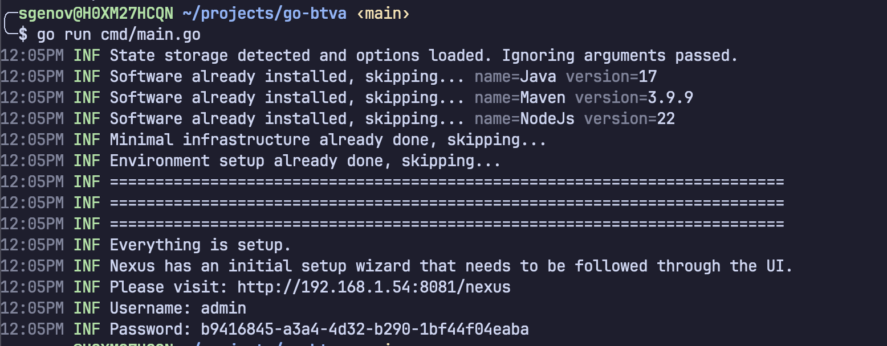

# go-btva

Sets UP BTVA for local development.

## Overview

[Build Tools For VMware Aria](https://github.com/vmware/build-tools-for-vmware-aria) is a tool that enabling easier development for automation on VCF.
BTVA comes with pre-requisites and even third party systems in order for everything to work correctly.

This tool aims to ease the initial setup.

## Installing

Go to the [releases](https://github.com/Michaelpalacce/go-btva/releases) and download the correct binary depending on your OS.
- The binaries are generated entirely in a [Github
  Action](https://github.com/Michaelpalacce/go-btva/blob/main/.github/workflows/build.yaml). The sha is shown in the [job run](https://github.com/Michaelpalacce/go-btva/actions/runs/14332857255/job/40172667918#step:4:262) and is also uploaded in the releases page.

## What This Is Not

- TBD, it's everything

## What This Is

- Setup minimal infra on a vm
    - [x] Run the minimal infrastructure installer
    - [x] Fetch Nexus Password
    - [x] Fetch Gitlab Password
    - [x] Create New Gitlab Public Access Token
    - [x] Register Gitlab Runner
- Setup dev environment
    - Supported os
        - [x] Linux (Ubuntu)
        - [x] MacOS
        - [ ] Windows
    - Configure
        - [x] Configure `settings.xml` for nexus and aria
        - [x] Provide Custom non minimal infra settings to integrate with other Artifact Managers
- Software
    - Ability to install software agnostic to the environment
        - [x] Install Java
        - [x] Install mvn
        - [x] Install NodeJS with `fnm`
        - [x] Install VSCode with recommended extensions
- At the end, give details to the user what their next steps should be
    - [x] Give Gitlab Credentials
    - [x] Give Nexus Credentials

## Action Items

### Good To Haves

- [ ] Window pop up
- [ ] Executable
- [ ] Working on windows
- [ ] Create a demo project
- [ ] Configure Other Artifact Managers?
- [ ] Air Gapped installation with provided installation scripts?

### Nice To Haves

- [ ] Move the scripts from inline to templates

## State

State is managed by a state file that is created where the tool is ran. After the initial run of the tool, CLI arguments are ignored and
instead the ones stored in the state file are used. If you want to do any changes, do so in the state file. As the whole process is
idempotent, you can also remove the state file and re-run with the desired arguments.

> State contains sensitive information for now. Be carefull when opening it.


<details>
    <summary>Finished state</summary>
    
</details>

## Development

We use `make` to run the program for dev

## Running

```sh
make run
```

## Cleanup

Cleanup scripts are provided for linux to ease testing. There is a generic `cleanup` goal that can be used to cleanup everything, or more
specific `cleanup-mvn` for example to cleanup specific components only.

```sh
make cleanup
```

## Tests

```sh
make test
```

## Makefile

The `Makefile` contains a bunch of different helper methods. You can run `make help` to get a description of what is available.

